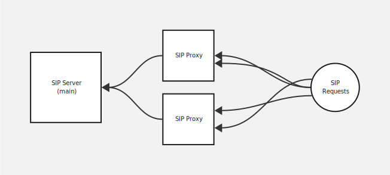

# C3 SIP Server

It's a SIP server, it's written in C3. 

More to come. 

# Sources

* [Building a VoIP Network with Nortel's Multimedia Communication Server 5100, Chapter 8: SIP Architecture](https://cdn.ttgtmedia.com/searchVoIP/downloads/Building_a_VoIP_Network_Ch[1]._8.pdf)
* [TransNexus - SIP INVITE header fields](https://transnexus.com/whitepapers/sip-invite-header-fields/)
* [Twilio Glossary - SIP Invites](https://www.twilio.com/docs/glossary/sip-invites)
* [Wikipedia - Session Initiation Protocol](https://en.wikipedia.org/wiki/Session_Initiation_Protocol)
* [RFC 3261 - SIP: Session Initiation Protocol](https://datatracker.ietf.org/doc/html/rfc3261)
* [OpenSIPS - Tools](https://www.opensips.org/Documentation/Tools)
* [Huntress - SIP Proxy](https://www.huntress.com/cybersecurity-101/topic/sip-proxy)
* [Cisco CallManager System Guide - Understanding Session Initiation Protocol](https://www.cisco.com/en/US/docs/voice_ip_comm/cucm/admin/4_0_1/ccmsys/a08sip.html)

