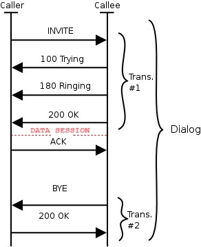

## SIP Lifecycle



Extract from RFC 3261
```
                     site-A.com  . . .  site-B.com
                  .    proxy              proxy     .
               .                                       .
       Alice's  . . . . . . . . . . . . . . . . . . . .  Bob's
      softphone                                        SIP Phone
         |                |                |                |
         |    INVITE F1   |                |                |
         |--------------->|    INVITE F2   |                |
         |  100 Trying F3 |--------------->|    INVITE F4   |
         |<---------------|  100 Trying F5 |--------------->|
         |                |<-------------- | 180 Ringing F6 |
         |                | 180 Ringing F7 |<---------------|
         | 180 Ringing F8 |<---------------|     200 OK F9  |
         |<---------------|    200 OK F10  |<---------------|
         |    200 OK F11  |<---------------|                |
         |<---------------|                |                |
         |                       ACK F12                    |
         |------------------------------------------------->|
         |                   Media Session                  |
         |<================================================>|
         |                       BYE F13                    |
         |<-------------------------------------------------|
         |                     200 OK F14                   |
         |------------------------------------------------->|
         |                                                  |

         Figure 1: SIP session setup example with SIP trapezoid
```

A dialog is a record of all SIP transactions (or, events) that occur during some interaction (where an interaction may be a phone call).

A dialog is typically made up of the following transactions:

1. INVITE 
   1. This is the first client-initiating messages, and is replied to with a provisional message, RINGING/TRYING
   2. This is the only request accepted without a Call-ID (as it will generate one), all other messages without one will be dropped
2. TRYING
   1. Sent back immediately before prevent request duplications (such as local SIP Proxy)
3. RINGING
   1. This may additionally include instructions for ringback (typically that it should happen)
      1. pre-connect, or "whisper" messages is an example of a product utilising this SIP "feature"
4. OK
5. ACK
6. BYE

Additionally, a SIP client can receive at any time in the Dialog the following:

1. OK
2. CANCEL
